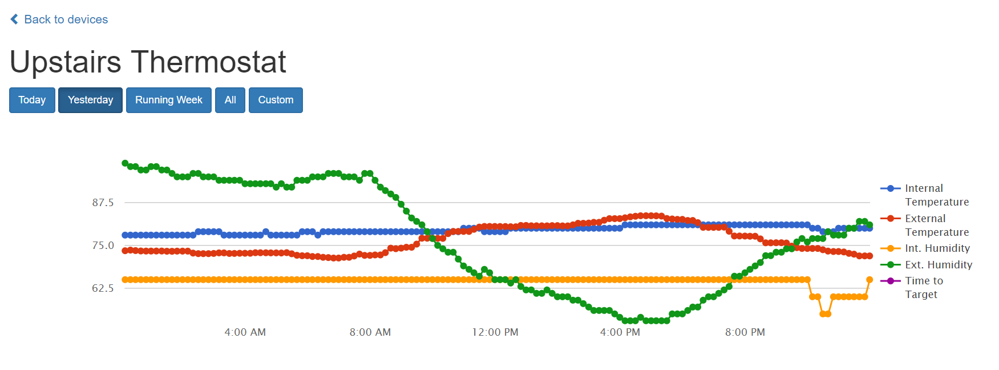

# README

This is a quick Ruby on Rails application that tracks your Nest Thermostats and (currently) graphs interal/external temperatures, internal/external humidity levels, and "time to target" information.  What follows is a brief guide on how to get this up and running.  This guide is written assuming the developer has a limited amount of experience with Ruby on Rails.

----------

> **Before Installing:**
> - This application was built using Ruby 2.4.0, Rails 5.1.2 and MySQL 14.14.  I developed this on a Windows machine with the Ubuntu on Windows Bash subsystem.  Follow this guide here<https://gorails.com/setup/windows/10> for a very comprehensive guide for getting up and running with Ubuntu on Windows. 
### INSTALLING

Clone and navigate into this repository

`git clone https://github.com/NiallBegley/nestgraph.git`

`cd nestgraph`

Install Gem dependencies

`bundle install`

Make sure your MySQL server is running

`sudo service mysql start`

Setup an environment variable file to specify your database password.  Create a new file named ".env" in the root directory of this project and add the following line:

`DB_PASSWORD=YOUR_PASSWORD`

Save the file and create the required database

`rake db:create`

`rake db:migrate`

### SETUP

This setup guide is mainly written for setup on a local machine, as opposed to deployment to a production environment such as Heroku.  
##### FORECAST IO

This project uses data pulled from ForecastIO for external weather data.  To use this feature you must first sign up as a developer at <https://darksky.net/dev/register> and enter your secret key in the .env file

`FORECAST_IO_SECRET=YOUR SECRET HERE`

ForecastIO allows you to make 1000 API queries a day without paying - keep this in mind while setting up your rake tasks later.  

While you're in .env, you must insert the following latitude and longitude variables so ForecastIO can automatically get weather from your location:

`FORECAST_IO_LATITUDE=YOUR LATITUDE`

`FORECAST_IO_LONGITUDE=YOUR LONGITUDE`

##### DEVISE

This application uses Devise to restrict visibility of your Nest data by requiring you to create one account local to this application.  After one account is created, no further users can be created to prevent unwanted signups if the application is deployed externally (ie Heroku).

You now need to setup your single user account.  To do so, start your rails server with the command

`rails server`

Now open a browser to http://localhost:3000.  You should be presented with a login page.  Click the "sign up" button and enter an email and a password.

##### NEST

Nest requires you to link your account to this application to authorize it to fetch data from your thermostats.  To do so, you must create a developer account with Nest and create a new product to allow this application to interface with your thermostats.  Visit <https://developers.nest.com/products> and create a product - the specific information you provide doesn't matter much, as you'll likely be the only person using this.  Once you've created a product, grab the Product ID and Product Secret and put them in your .env file:

`NEST_PRODUCT_ID=YOUR_PRODUCT`

`NEST_PRODUCT_SECRET=YOUR_SECRET`

Navigate to http://localhost:3000 and click the "Refresh Device List" button at the bottom of the page to force the application to interface with the Nest API.  If you switch back to your rails server window, you should see the following text prompt:

`Please generate a pin code at https://home.nest.com/login/oauth2?state=STATE&client_id=CLIENT_ID and enter it here:`

Follow the URL, login to your Nest account, approve the permission required and paste the PIN code into the console and hit enter.

> **Production Note:**
>- If setting this up in a production environment (Heroku), you would store your product ID and secret in the config variables and open a Heroku bash terminal and run the `rake nestgraphing:providecredentials` command.  You would then be prompted to enter the returned auth token into your Heroku config variables and restart the server.
>- The nest_api gem not only takes advantage of local server prompt stdin (unavailable with Heroku) but also the local file system, which makes the development system of tying this application to your Nest account unusable.
##### RAKE TASKS

You'll need to set up one cron job to run a rake task for periodically collecting internal/external data and, optionally, a second that periodically deletes data older than a week.

The ins and outs of setting up the cron jobs is outside the scope of this document and highly system dependant, so I'll just say that if you are running this application using Ubuntu on Windows, you can set it up to perform this periodic executions of the rake tasks, but the cron service needs to be manually restarted if all Ubuntu on Windows windows have been closed.  Additionally, the jobs will not run if unless at least one Ubuntu on Windows window is open.

The two tasks are executed as follows:

`rake nestgraphing:fetchdata` - This will fetch one set of data points for each thermostats in your Nest account.  I set this up to run once every 15 minutes.

`rake nestgraphing:deleteoldrecords` - This will delete all record data older than 7 days.  This is useful if you're running on Heroku and trying to keep your database size within the free limit.  I set this up to run once a day.

### Finally!

You should be up and running at this point.  Allow your cron job to collect data and check back to see your data graphed out.

### TO DO

This application was written in the middle of the summer in a house with no air conditioning, so it currently does not support graphing of heat/cooling turning on/off.  "Time to Target" functionality is implemented to a certain degree, but untested.